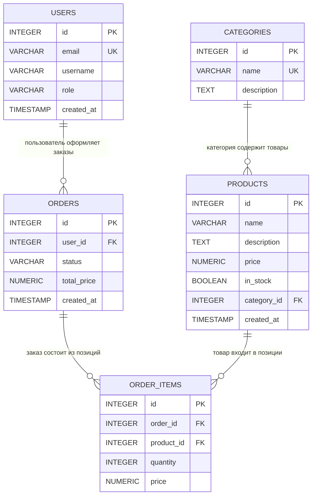

# Домашнее задание: ERD-диаграмма — Связи между сущностями

**Зачем?**
На прошлом ДЗ вы описали сущности вашего проекта с типами полей. Теперь нужно определить, как эти сущности связаны между собой: один-ко-многим, многие-ко-многим, один-к-одному. Результат — ERD-диаграмма, которая станет основой для DDL-запросов (CREATE TABLE с FOREIGN KEY).

---

## Что нужно сдать

1. **Файл `erd.md`** — ERD-диаграмма вашего проекта в формате Mermaid (рендерится прямо на GitHub) или в виде скриншота.
2. **Описание связей** — текстом в том же файле: какие сущности связаны, какой тип связи и почему.
3. **Файл `entities.md`** — обновлённая версия с прошлого ДЗ, где добавлены внешние ключи (FK) в поля.

---

## Краткая справка по типам связей

### Один-к-одному (1:1)

Одна запись в таблице A соответствует **ровно одной** записи в таблице B.

```
Пример: User → Profile (у одного пользователя один профиль)
Реализация: FK в таблице Profile со UNIQUE-ограничением
```

### Один-ко-многим (1:N) — самый частый тип

Одна запись в таблице A может иметь **много** записей в таблице B, но каждая запись B принадлежит **только одной** записи A.

```
Пример: User → Orders (у одного пользователя много заказов, но заказ принадлежит одному пользователю)
Реализация: FK в таблице B (orders.user_id → users.id)
```

### Многие-ко-многим (M:N)

Записи в таблице A могут быть связаны с **множеством** записей в таблице B и наоборот.

```
Пример: Students ↔ Courses (студент ходит на много курсов, курс посещает много студентов)
Реализация: промежуточная таблица (students_courses со всеми какими (students.id, courses.id))
```

---

## Пример ERD-диаграммы (интернет-магазин)

Ниже — пример для интернет-магазина. **Вам нужно сделать такую же диаграмму, но для вашего проекта.**

### Mermaid-код (скопируйте и вставьте в .md файл на GitHub — он отрендерится)



### Как это выглядит на GitHub

Когда вы вставите этот блок ` ```mermaid ` в `.md` файл на GitHub, он автоматически нарисует диаграмму. Если хотите посмотреть прямо сейчас — вставьте код на [Mermaid Live Editor](https://mermaid.live/).

### Описание связей для примера

| Связь | Тип | Описание |
|-------|-----|----------|
| Users → Orders | 1:N | Один пользователь может оформить много заказов |
| Categories → Products | 1:N | В одной категории много товаров |
| Orders → Order Items | 1:N | Один заказ состоит из нескольких позиций |
| Products → Order Items | 1:N | Один товар может входить в много позиций заказов |
| Orders ↔ Products | M:N | Через промежуточную таблицу `order_items` — заказ содержит много товаров, товар входит в много заказов |

---

## Что нужно сделать (пошагово)

### Шаг 1. Вспомните ваши сущности

Откройте `entities.md` с прошлого ДЗ. Перечислите все сущности, которые вы описали.

### Шаг 2. Определите связи между сущностями

Для каждой пары сущностей задайте себе вопросы:

1. **Может ли одна запись в A иметь несколько записей в B?**
2. **Может ли одна запись в B иметь несколько записей в A?**

| Ответ на 1 | Ответ на 2 | Тип связи |
|------------|------------|-----------|
| Нет        | Нет        | 1:1       |
| Да         | Нет        | 1:N (A→B) |
| Нет        | Да         | 1:N (B→A) |
| Да         | Да         | M:N (нужна промежуточная таблица) |

### Шаг 3. Нарисуйте ERD-диаграмму в Mermaid

Создайте файл `erd.md` и напишите Mermaid-код по шаблону:

````markdown
```mermaid
erDiagram
    ENTITY_NAME {
        TYPE field_name PK
        TYPE field_name FK
        TYPE field_name
    }

    ENTITY_A ||--o{ ENTITY_B : "описание связи"
}
```
````

**Синтаксис связей в Mermaid:**

| Синтаксис | Значение |
|-----------|----------|
| `A \|\|--\|{ B` | Один-ко-многим (обязательный) |
| `A \|\|--o{ B` | Один-ко-многим (может быть пустым) |
| `A \|\|--\|\| B` | Один-к-одному |
| `A }o--o{ B` | Многие-ко-многим |

### Шаг 4. Опишите связи текстом

В том же файле `erd.md` добавьте таблицу связей (как в примере выше):

| Связь | Тип | Описание |
|-------|-----|----------|

### Шаг 5. Обновите entities.md

Вернитесь в `entities.md` и добавьте:

- **FK-поля** — внешние ключи, которые вы определили на шаге 2
- **Промежуточные таблицы** — если у вас есть связи M:N, добавьте таблицы для них
- **Раздел "Связи"** под каждой сущностью с указанием FK → куда ссылается

---

## Что ожидается от студента (контрольные точки)

- [ ] В `erd.md` есть Mermaid-диаграмма со всеми сущностями проекта
- [ ] На GitHub диаграмма рендерится (проверьте перед отправкой)
- [ ] Каждая связь подписана (что значит стрелка)
- [ ] Связи описаны текстом в таблице
- [ ] Все связи M:N решены через промежуточные таблицы
- [ ] В `entities.md` добавлены FK-поля
- [ ] Минимум 3 связи между сущностями
- [ ] Нет "висячих" сущностей без связей (каждая сущность связана хотя бы с одной другой)

---

## Вопросы для самопроверки

Напишите короткие ответы в `erd.md` в конце файла. Своими словами:

1. Чем связь 1:N отличается от M:N? Приведите пример каждой из вашего проекта.
2. Почему связь M:N нельзя реализовать двумя таблицами? Зачем нужна промежуточная?
3. Что будет, если удалить запись, на которую ссылается FK? (Подумайте, мы разберём это на лекции)
4. Может ли FK быть NULL? Когда это полезно?

---

## Дедлайн

03.06.2026, 12:00 по МСК

---

## Как сдать

1. Создайте файл `erd.md` с Mermaid-диаграммой и описанием связей.
2. Обновите `entities.md` — добавьте FK-поля и промежуточные таблицы.
3. Убедитесь, что Mermaid рендерится на GitHub (откройте файл в репозитории).
4. Пришлите ссылку на репозиторий преподавателю.

---

## Полезные ресурсы

- [Mermaid Live Editor](https://mermaid.live/) — редактор с предпросмотром
- [Mermaid ER Diagram — документация](https://mermaid.js.org/syntax/entityRelationshipDiagram.html)
- [Lucidchart](https://www.lucidchart.com/) — альтернатива для рисования ERD (если не хотите Mermaid)
- [DrawSQL](https://drawsql.app/) — ещё один инструмент для ERD-диаграмм
