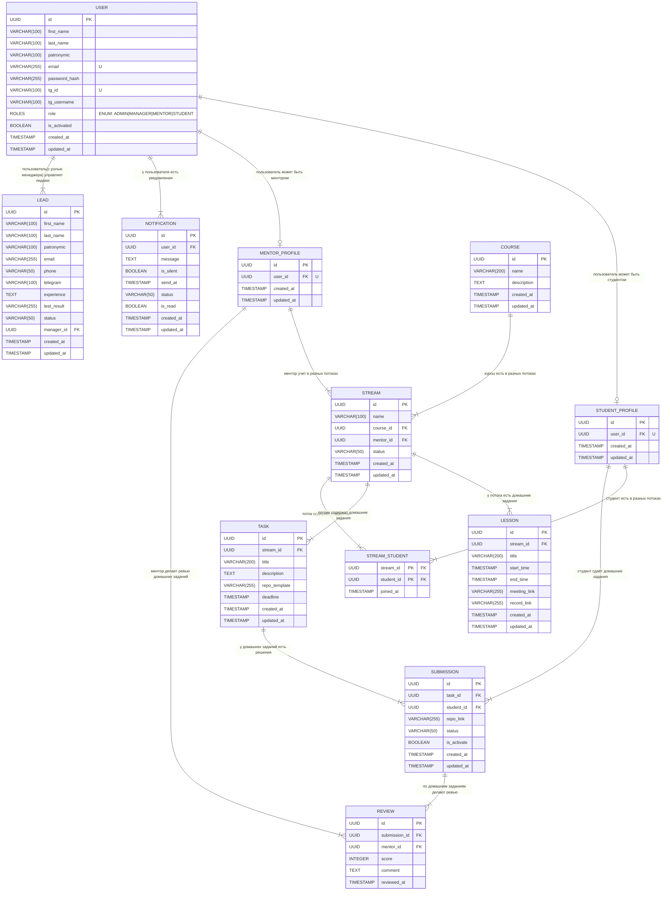

### Описание связей

| Связь                            | Тип | Описание                                                                                                      |
| -------------------------------- | --- | ------------------------------------------------------------------------------------------------------------- |
| USER → LEAD                      | 1:N | Один менеджер может управлять разными лидами                                                                  |
| USER → NOTIFICATION              | 1:N | У одного пользователя может быть много уведомлений                                                            |
| USER → MENTOR_PROFILE            | 1:1 | У одного пользователя может быть лишь один профиль ментора                                                    |
| USER → STUDENT_PROFILE           | 1:1 | У одного пользователя может быть лишь один профиль студента                                                   |
| STUDENT_PROFILE → SUBMISSION     | 1:N | У студента может быть много сданных работ                                                                     |
| STUDENT_PROFILE → STREAM_STUDENT | 1:N | Студент может быть в множестве потоков                                                                        |
| STREAM → STREAM_STUDENT          | 1:N | Поток может быть у множества студентов                                                                        |
| STUDENT_PROFILE ↔ STREAM         | M:N | Через промежуточную таблицу `STREAM_STUDENT` - студент содержит много потоков, поток входит в много студентов |
| MENTOR_PROFILE → REVIEW          | 1:N | У одного ментора может быть множество ревью                                                                   |
| SUBMISSION → REVIEW              | 1:N | У одной сданной работы может быть множество ревью                                                             |
| TASK → SUBMISSION                | 1:N | У одного ТЗ может быть много сданных работ                                                                    |
| STREAM → TASK                    | 1:N | У одного потока может быть много ТЗ                                                                           |
| COURSE → STREAM                  | 1:N | У одного курса может быть много потоков                                                                       |
| MENTOR_PROFILE → STREAM          | 1:N | У одного ментора может быть много потоков                                                                     |
| STREAM → LESSON                  | 1:N | У одного потока может быть много занятий                                                                      |

### Ответы на вопросы:

1. Чем связь 1:N отличается от M:N? Приведите пример каждой из вашего проекта.

_Ответ:_
Отличается тем, что 1:N - это когда один элемент таблицы может быть в множестве других, а M:N - это когда один элемент таблицы может быть связан со многими элементами из второй, и наоборот.

2. Почему связь M:N нельзя реализовать двумя таблицами? Зачем нужна промежуточная?

_Ответ:_
Потому что нужна связь между двумя таблицами, а для такого достаточно и одной.
Промежуточная таблица нужна для связи, когда один объект из первой таблицы может быть связан со многими объектами из второй, и наоборот.

3. Что будет, если удалить запись, на которую ссылается FK? (Подумайте, мы разберём это на лекции)

_Ответ:_
Это зависит от того, какое удаление мы указали.
Если у нас `каскадное (cascade)` удаление, то зависимые записи (строки) имеющие в себе fk-колонку просто удалятся.
Если у нас `ограничивающие (restrict)` удаление, то бдшка вернёт ошибку и полностью отменит операцию на удаление.

4. Может ли FK быть NULL? Когда это полезно?

_Ответ:_
Да. Полезно может быть, например, в моём проекте с таблицами `lead` и `user`, когда заявка только падает в CRM от незарегистрированного кандидата, у неё ещё нет ответственного менежера, а значит `manager_id` будет **NULL**. Как только менеджер берёт заявку в работу, туда записывается его **ID**.
